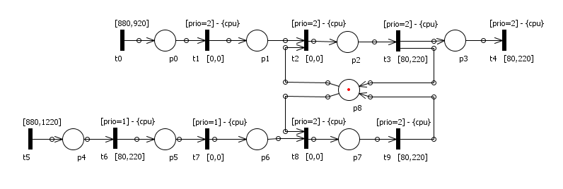

# Introduction
Preemptive Time Petri Nets (**PTPNs**) support modeling and analysis of concurrent timed SW components running under fixed priority preemptive scheduling. 
This work is based on the [Sirio Library](https://github.com/oris-tool/sirio)\[1\] and is an extension of **Lorenzo Macchiarini**\[2\] work. 
We try to read a preemptive time petri net (PTPN) and verify the feasibility of a real time program execution log. 

For a detailed description of the experiments and results obtained refer to the project [presentation]() (coming soon).

### Algorithm
Here is the pseudo-algorithm to check the log feasibility:

1. Read next transition *t* and time to fire *tau* from log
2. Check if *t* is an *enabled transition*
3. Check if *t* is a *progressing transition*
4. Check if *tau* is in the [min<sub>t</sub> , max<sub>t</sub>] interval provided from PTPN
5. Check if *tau* is <= max<sub>t'</sub> for each progressing transition t'
6. If all above checks are ok, update the time to fire of enabled transitions and go to 1

# Inputs 
### PTPN
You need to create a PTPN model of your real time program. We reccomend to use **Oris tool**\[3\] in order to create Java code from a graphic model

### Log
The log file must be a `.txt` file in this format:
```
[transition name]
[time to fire]
[transition name]
[time to fire]
...
```
Example:
```
t0
900
t1
30
t5
260
...
```
Note that you need to provide the same transition name of PTPN transitions


# Repository structure
The respository extension is structured as follows:
- The ```src/main/java/org/oristool/logVerifier/LogVerifier.java```
Class contains the public method *isLogFeasible(PetriNet pn, String logName, Marking m)* which returns a boolean value indicating the log feasibility.
- ```src/test/java/org/oristool/logVerifier/LogVerifierTest.java``` is a JUnit Test where we have used a PTPN and a log to test the LogVerifier Class (please check the Example section).

# Example
This is the PTPN model used in JUnit Test
<p float="left" align="center">
  
</p>

the ```log.txt``` file is like this:
```
t0
910
t1
0
t2
0
t5
70
t3
30
t4
150
...
```

## Output
The output will be:
```
Checking t0 910
Passed. Updated enabled transitions are: [t0, t1, t5]
Checking t1 0
Passed. Updated enabled transitions are: [t0, t2, t5]
Checking t2 0
Passed. Updated enabled transitions are: [t0, t3, t5]
Checking t5 70
Passed. Updated enabled transitions are: [t0, t3, t5, t6]
...
Log feasible: true
```

Now let's change the log to something unfeasible. For example, if you chage the first time to fire of *t2* to 10 (instead of 0), the output changes to:
```
Checking t0 910
Passed. Updated enabled transitions are: [t0, t1, t5]
Checking t1 0
Passed. Updated enabled transitions are: [t0, t2, t5]
Checking t2 10
Time to fire of transition t2 non fesible!
Log feasible: false
```


## Bibliography
\[1\] Sirio Library: [https://github.com/oris-tool/sirio](https://github.com/oris-tool/sirio).

\[2\] Lorenzo Macchiarini GitHub profile: [https://github.com/loremacchia](https://github.com/loremacchia).

\[3\] Oris Tool: [https://github.com/oris-tool/sirio](https://www.oris-tool.org/).

# Acknowledgments
Software Engineering for Embedded Systems - Computer Engineering Master Degree @[University of Florence](https://www.unifi.it/changelang-eng.html).
